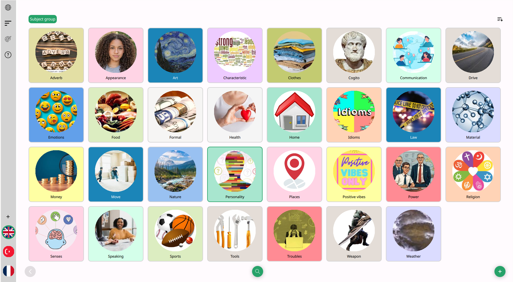
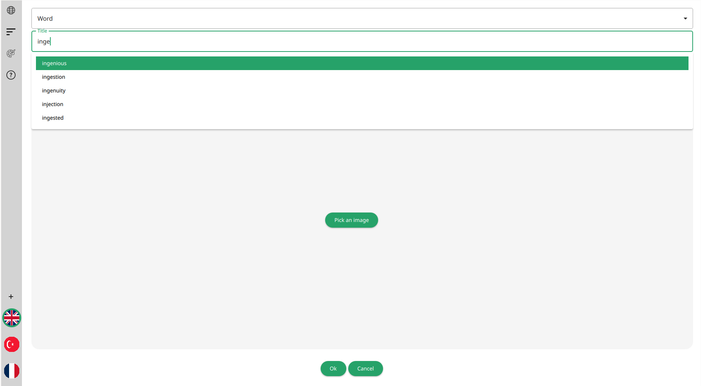
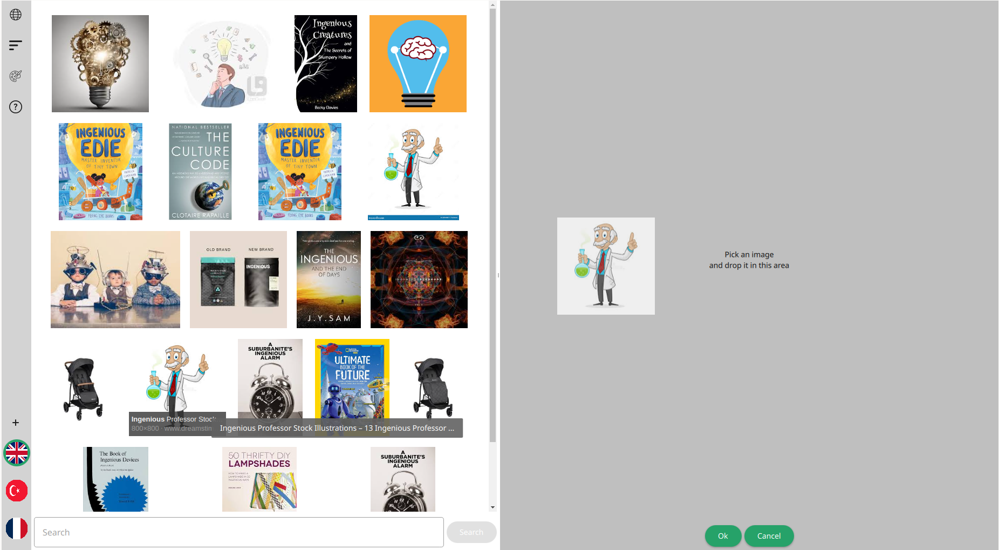
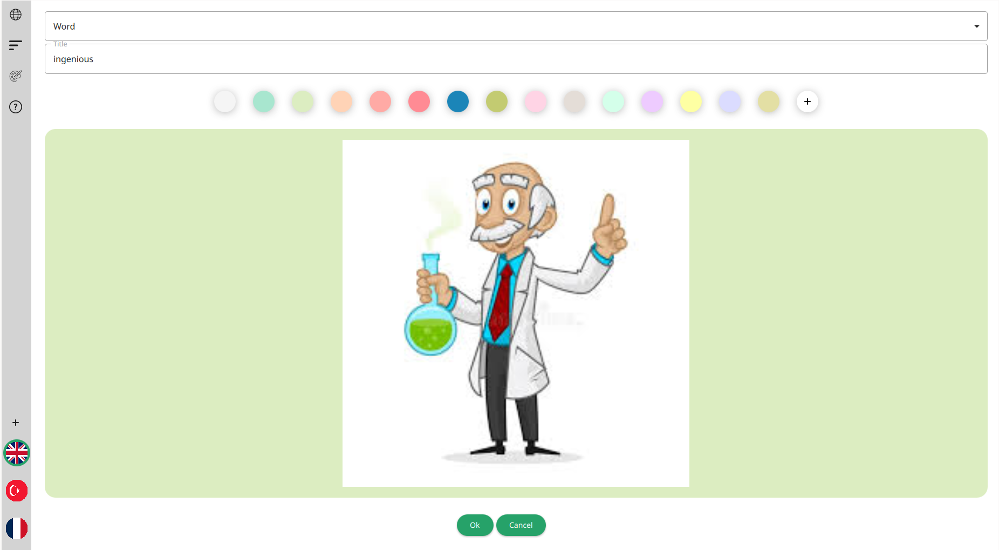
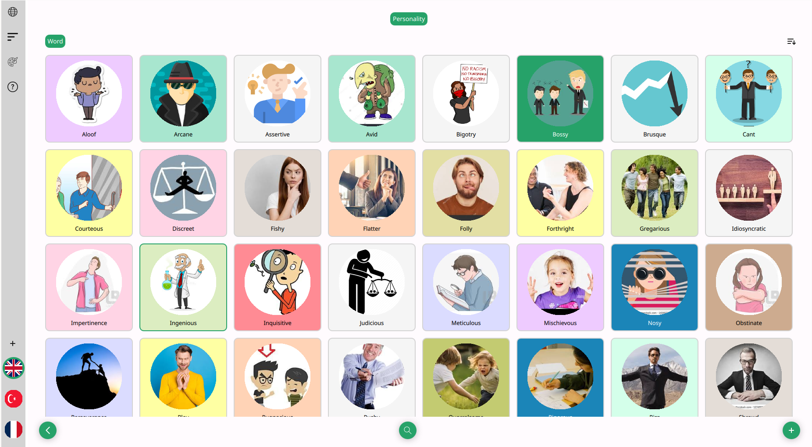
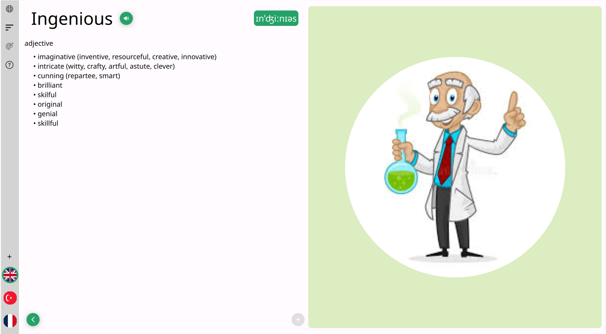

 
 
 
 

  

**Lexis** is a vocabulary-builder desktop app, which helps you to organize a library of words to learn.
Using **Lexis**, you can create your own collections of words, grouping them as you wish.

## Example of use
Lets pretend you're reading some book and encounter an unknown word *ingenious*.
You'd like to learn it, but instead of writing it down to some piece of paper or a note-taking app, you can add it to your word
collection in **Lexis**. This way you'll get a dictionary definition of the word with a picture associated with
its meaning, plus the transcription with an audiable pronunciation - pretty much handy, isn't it?
Using Lexis, you can combine words into groups by subject, create an entry in your collection for any source you learn the new word from:
it can be a book or a song, or something else.

1. Since the word *ingenious* may be used to describe a person, you can add it to the *Personality* subject group.

  

2. Having opened the group, you can create a new item by pressing a *New item* button at the right bottom corner and type
the desired word in the language you're learning:

  

3. Pick an image best associated with the meaning of this word and drag it to the specified area. In case search results don't
reflect the meaning of the word too good, you can type a different word or phrase in any language in the bottom bar and search again:

  

4. Assign a background color to make a new item more distinguishable from the rest of the collection:

  

5. You can see a new word added into the collection:

  

6. Open it, and voilà!

  

In case the dictionary doesn't provide any meaning for the word or phrase, you may add it yourself into the library.
You may also revise the groups added into the collection by moving them or their contents around the library.

## Features

### Search
Use the toolbar search button or **Ctrl+F** to find words and folders across the entire library. Results show a breadcrumb path; selecting a word opens its card, selecting a folder navigates into it.

### Quiz
Start a multiple-choice quiz from the toolbar (**Ctrl+Shift+Q**), the sidebar *Library data* menu, or an item's context menu. The quiz uses words from the current folder (or the whole language at the root level). Each session mixes **word → translation** and **translation → word** questions. You pick the correct answer from four options; results show your score and accuracy at the end.

### Statistics
Open library-wide statistics from *Library data → Statistics*, or per-item statistics from an item's context menu. View word counts, recent additions, and a breakdown of words by subject group.

### Library data (desktop)
From the sidebar settings icon:
- **Export language** — save one language as a `.lexis` archive
- **Import language** — merge a `.lexis` archive into the library
- **Backup database** — copy the full SQLite database
- **Restore database** — replace the local database from a backup

Duplicate titles are detected automatically and can be resolved from a dedicated dialog.

## Keyboard shortcuts
Press **Alt+4** or open *Help* from the sidebar to see the full shortcut list.

| Shortcut | Action |
|----------|--------|
| Esc / Alt+← | Back |
| Ctrl+F | Search |
| Ctrl+N | New item |
| Ctrl+Shift+Q | Quiz |
| Ctrl+Q | Quit |
| Alt+1 … Alt+4 | Interface language, sort rule, color, help |

## Supported languages
There are nine languages available to learn using **Lexis**:
- english
- spanish
- german
- french
- russian
- italian
- polish
- ukranian
- turkish

Also, two languages can be used as interface language: english and russian.

## Target platform
So far, build configuration for Linux, Windows and Android platforms has been done. A build for MacOS is also achievable due to Qt's cross-platform support.

## Dependencies
**Lexis** uses several third-party services which you need to get API_KEY to:
- [Yandex predictor](https://yandex.com/dev/predictor/)
- [Yandex dictionary](https://yandex.com/dev/dictionary)
- [Google Programmable Search Engine](https://programmablesearchengine.google.com/about/)
- [Eleven labs](https://elevenlabs.io/)
- [PlayHT](https://play.ht/)

These keys are currently used as compile definitions, which makes them necessary to build an executable program file.
