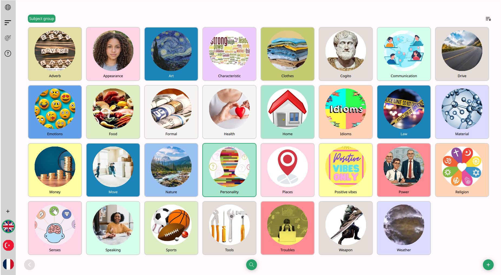
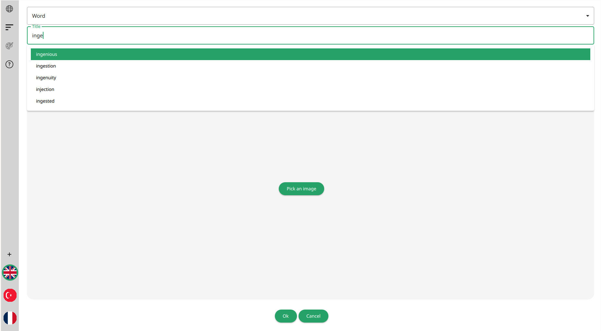
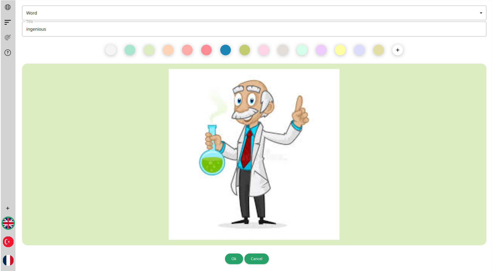
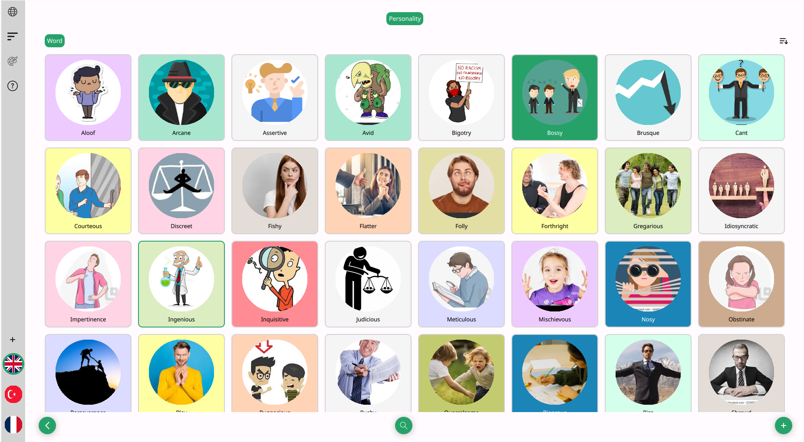

 
 
 
 

**Lexis** is a vocabulary-builder desktop app, which helps you to organize a library of words to learn.
Using **Lexis**, you can create your own collections of words, grouping them as you wish.

## Example of use
Lets pretend you're reading some book and encounter an unknown word *ingenious*.
You'd like to learn it, but instead of writing it down to some piece of paper, you can add it to your word
collection in **Lexis**. This way you'll get a dictionary definition of the word with a picture associated with
its meaning, plus the transcription with an audiable pronunciation - pretty much handy, isn't it?

1. Since the word *ingenious* may be used to describe a person, you can add it to the *Personality* subject group.

2. Having opened the group, you can create a new item by pressing a *New item* button at the right bottom corner and type
the desired word in the language you're learning:

3. Pick an image best associated with the meaning of this word and drag it to the specified area. In case search results don't
reflect the meaning of the word too good, you can type a different word or phrase in any language in the bottom bar and search again:

4. Assign a background color to make a new item more distinguishable from the rest of the collection:

5. You can see a new word added into the collection:

6. Open it, and voilà!

In case the dictionary doesn't provide any meaning for the word or phrase, you may add it yourself into the library.
You may also revise the groups added into the collection by moving them or their contents around the library.

## Supported languages
There are nine languages available to learn using **Lexis**:
- english
- spanish
- german
- french
- russian
- italian
- polish
- ukranian
- turkish

## Dependencies
**Lexis** uses several third-party services which you need to get API_KEY to:
- [Yandex predictor](https://yandex.com/dev/predictor/)
- [Yandex dictionary](https://yandex.com/dev/dictionary)
- [Google Programmable Search Engine](https://programmablesearchengine.google.com/about/)
- [Eleven labs](https://elevenlabs.io/)
- [PlayHT](https://play.ht/)

These keys are currently used as compile definitions, which makes them necessary to build an executable program file.
