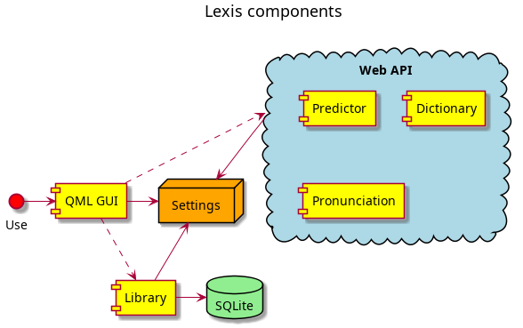
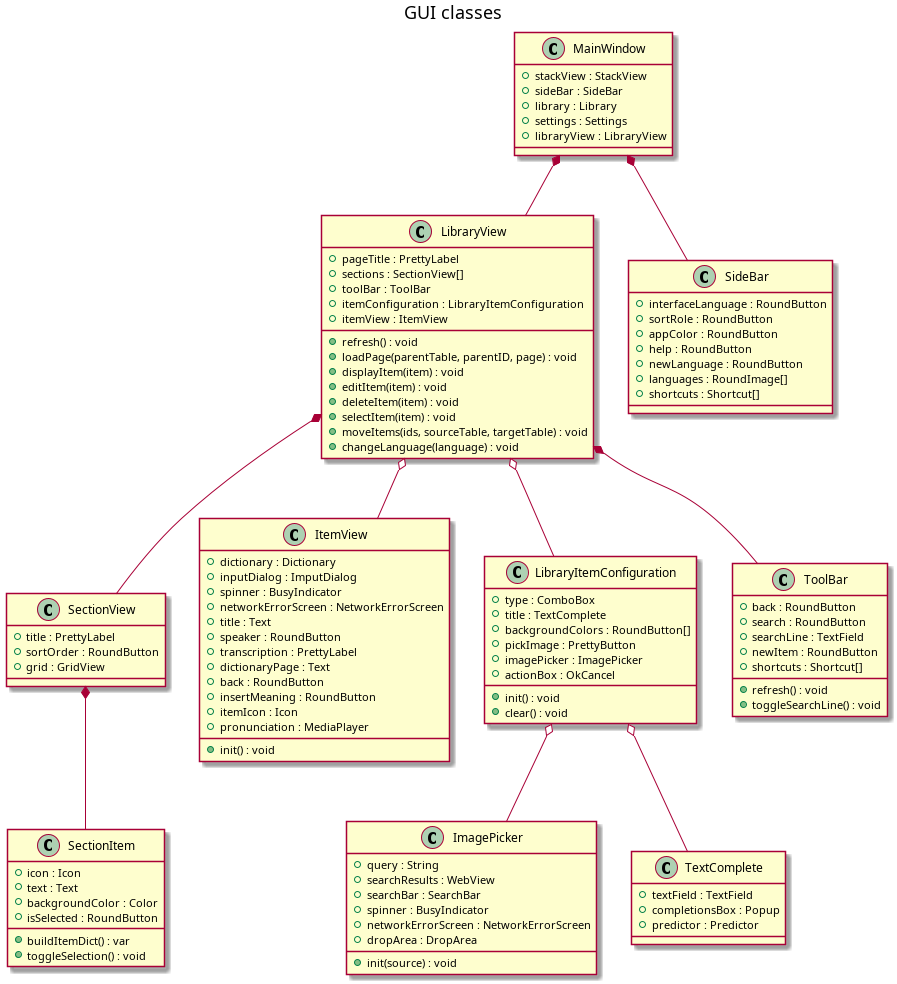
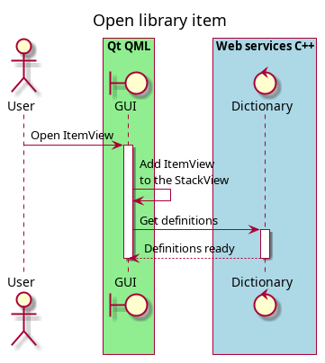
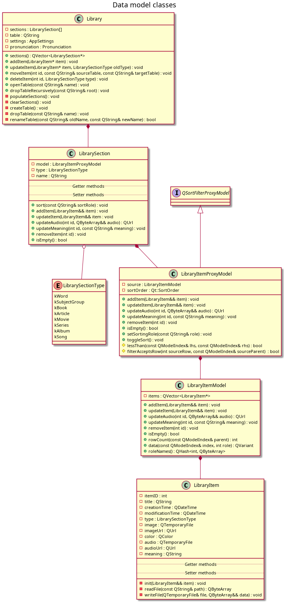
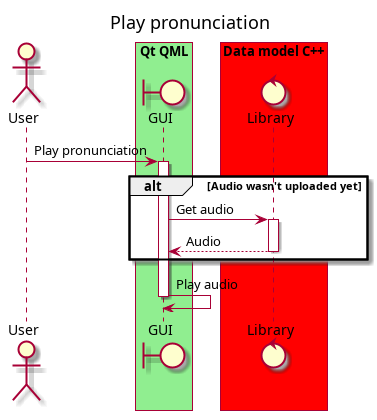
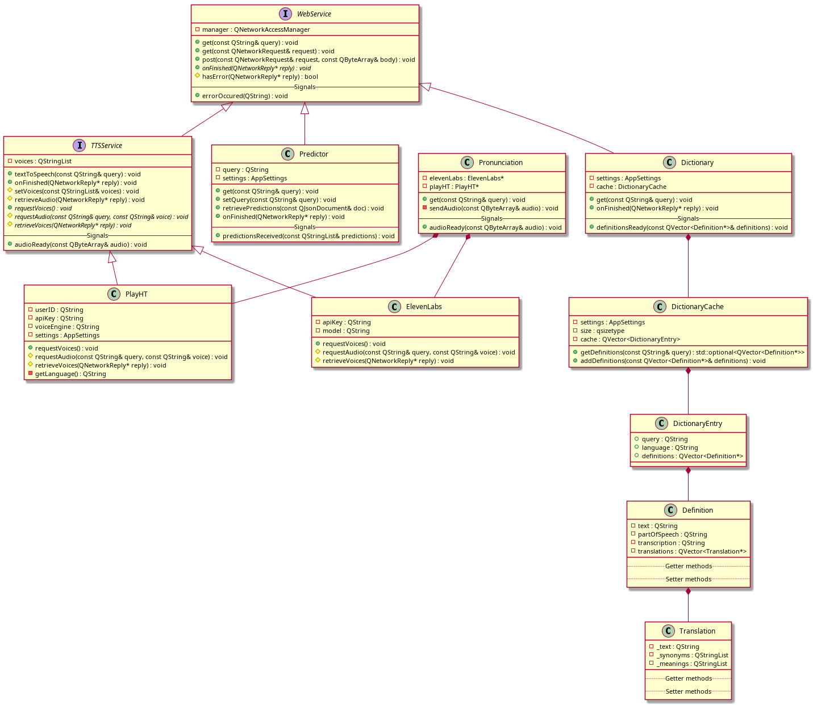
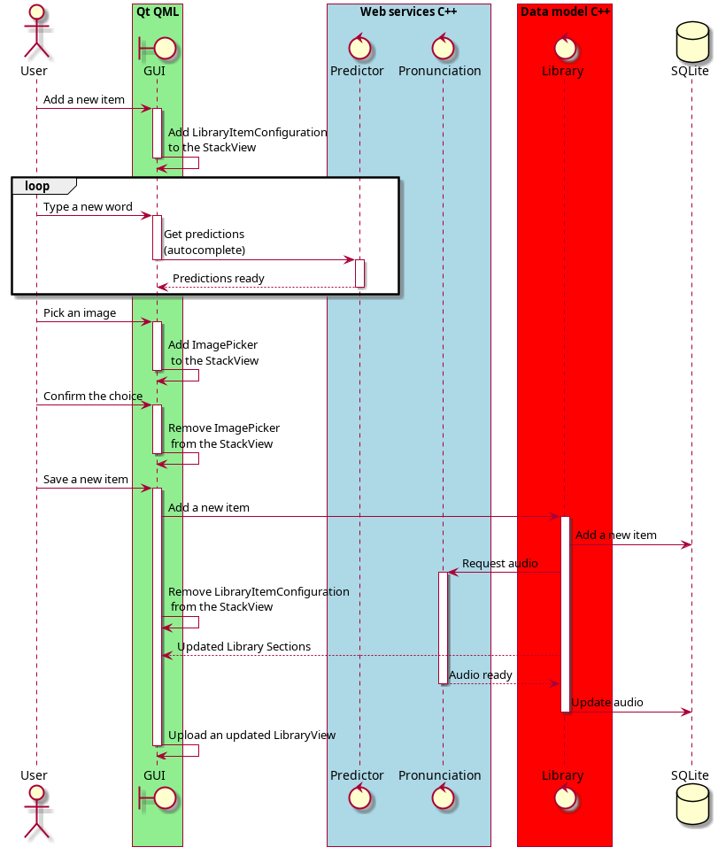

**Lexis** is entirely implemented using **Qt** framework and built with **CMake** build system.

On a high level, it comprises of:
- QML-written GUI
- `Library` storing user's words collection in **SQLite** database
- several classes providing access to web services: `Dictionary`, `Predictor` and `Pronunciation`
- `Settings`: languages being learned, interface language, user preferences

One can think of Lexis as of a web app with QML frontend and C++ backend.

  

## Graphic interface
Graphic interface is written in **QML** markup language and Qt's dialect of **JavaScript** language.
Some of C++ classes are also incorporated into QML code and used directly due to [Qt support](https://doc.qt.io/qt-6/qtqml-cppintegration-definetypes.html) for integration of C++ types into QML.

Another way for C++ and QML parts to communicate is one of the most well-known Qt mechanisms - [signals and slots](https://doc.qt.io/qt-6/signalsandslots.html).

JavaScript is used in QML modules to implement functions operating on data. It is a sort of glue connecting GUI elements together.
You can see a QML GUI classes diagram below. Some of GUI elements are depicted in `docs/images` directory.

  

`MainWindow` contains a [StackView](https://doc.qt.io/qt-5/qml-qtquick-controls2-stackview.html) to display pages and a `SideBar` on the left side.

`LibraryView` is the default page of the StackView and probably the main page of the app.
It displays user's collection and used to navigate between levels of the collection. It also has a `ToolBar` to search for existing elements, start a quiz, and add new ones.
The collection is splitted into sections by type (words, subject group, etc) and groups of `SectionView` elements serve to visualize sections.
Each SectionView has a [GridView](https://doc.qt.io/qt-6/qml-qtquick-gridview.html) to display `SectionItems`, representing the smallest unit of the collection.

`SearchView` is an overlay on `LibraryView` for library-wide search. It is backed by `LibrarySearch` on the C++ side and returns matches with breadcrumb paths.

`ItemView` displays the dictionary definitions of a chosen word, pronunciation button, transcription and an icon. In case dictionary service doesn't provide any information on a word of interest,
the user may add their own notes on it using `insertMeaning` button.

`QuizView` is pushed onto the StackView for multiple-choice vocabulary quizzes. It loads translations for words in the current scope via stored meanings, cached translations, and the `Dictionary` service, then presents up to ten questions with immediate feedback. Questions alternate randomly between showing a word and asking for its translation, and showing a translation and asking for the word.

  

When an item is being added or modified, a `LibraryItemConfiguration` page is pushed onto the stack, and a `ImagePicker` page is used to select a picture for the item.
ImagePicker showcases pictures to choose from via a [WebView](https://doc.qt.io/qt-6/qml-qtwebview-webview.html) displaying search results of the [Google Programmable Search Engine](https://programmablesearchengine.google.com/about/).

There is also a bunch of modal dialog windows for various purposes: from configuring menu settings (`InterfaceLanguageDialog`, `SortRoleDialog`, `HelpDialog`, etc) to
performing operations on items (`DeleteDialog`, `MoveDialog`, `DuplicateItemDialog`, `StatisticsDialog`, etc).

The sidebar *Library data* menu (desktop) exposes export/import of `.lexis` language archives and SQLite database backup/restore through `Library` methods implemented in `LibraryArchive`.

## Data model
Library is responsible for maintaining user's words collection: storing it into SQLite database as well as exposing the collection into QML code.

  

Library performs all operations on items that involve storage access, including: read, update, delete, and move.
Items form a tree: each row belongs to a language and optionally to a parent item via `parent_id`. Words, subject groups, books, and other section types are distinguished by a `type` field (`LibrarySectionType`).

The database uses a normalized schema managed by `SchemaMigration`:
- `schema_version` — current schema version
- `languages` — registered learning languages (`code`)
- `items` — all library entries with columns for `language_code`, `parent_id`, `title`, `type`, timestamps, `color`, `meaning`, `cached_translation`, `image`, and `audio`

On startup, `SchemaMigration::ensureSchema` creates the v1 schema or migrates legacy databases that used per-level tables named after language codes and item indices (for example `en_3_11`). Child rows are deleted automatically through `ON DELETE CASCADE`.

Navigation in QML tracks a `parentStack` of folder ids; `Library::openLanguage`, `openFolder`, and `openRoot` load direct children of the current parent into typed `LibrarySection` groups.

Supporting modules:
- `LibrarySearch` — full-library text search with breadcrumbs
- `LibraryStatistics` — aggregate and per-item stats, including scoped word lists for quizzes
- `LibraryArchive` — `.lexis` JSON export/import and database file copy

When providing the collection data to QML, it is sorted into groups of `LibrarySection` by type. To enable sorting and filtering for the sections, a `LibraryItemProxyModel`
extending [QSortFilterProxyModel](https://doc.qt.io/qt-6/qsortfilterproxymodel.html) was added. It serves as a wrapper for the actual `LibraryItemModel` possessing the collection of `LibraryItems`.

`TreeModel` exposes the folder hierarchy for `MoveDialog`, which also supports searching destination folders.

One more chore of the Library is to request audio from `Pronunciation` service when a new word is added into the collection, or the existing word's title is changed.
Audio fetch is an asynchronous operation, since it may take some time, and we don't want to freeze GUI during that. Library stores requested audio per item and provides it to `ItemView` and `QuizView` on demand.

  

## Web services
Lexis actively fetches data from the internet using classes implementing `WebService` interface. This interface utilizes [QNetworkAccessManager](https://doc.qt.io/qt-6/qnetworkaccessmanager.html) to make REST API requests. The derived classes override `onFinished` slot method to handle responses.

  

`Predictor` is the first of such classes, and it is used for text autocomplete. When a user adds a new item into the collection and types the word into the text field, Predictor
provides a list of suggestions ("predictions") displayed below the text field. An actual web service API generating predictions list is [Yandex Predictor API](https://yandex.com/dev/predictor/).

  

`Dictionary` provides definitions of the word by the means of [Yandex Dictionary API](https://yandex.com/dev/dictionary) when a user opens the `ItemView` page. This service utilizes
`DictionaryCache`, which implements the Least Recently Used (LRU) principle to reduce the number of REST API requests. Dictionary also takes into account current interface language,
which means that a change of the interface language will cause a cache miss when access the item that was added to the cache before the language change.

Presently, there are two text-to-speech services that implement `TTSService` interface: `ElevenLabs` and `PlayHT`. They match with corresponding projects: [Eleven labs](https://elevenlabs.io/)
and [Play HT](https://play.ht/). They are called alternately by `Pronunciation` class when a request to generate a pronunciation audio file is being processed to distribute the number of
requests over services equally.

## Settings
Lexis settings are manipulated with the help of the respective classes on both [QML](https://doc.qt.io/qt-6/qml-qt-labs-settings-settings.html) and [C++](https://doc.qt.io/qt-6/qsettings.html) 
sides. These classes provide Lexis with persistent platform-independent application settings.
